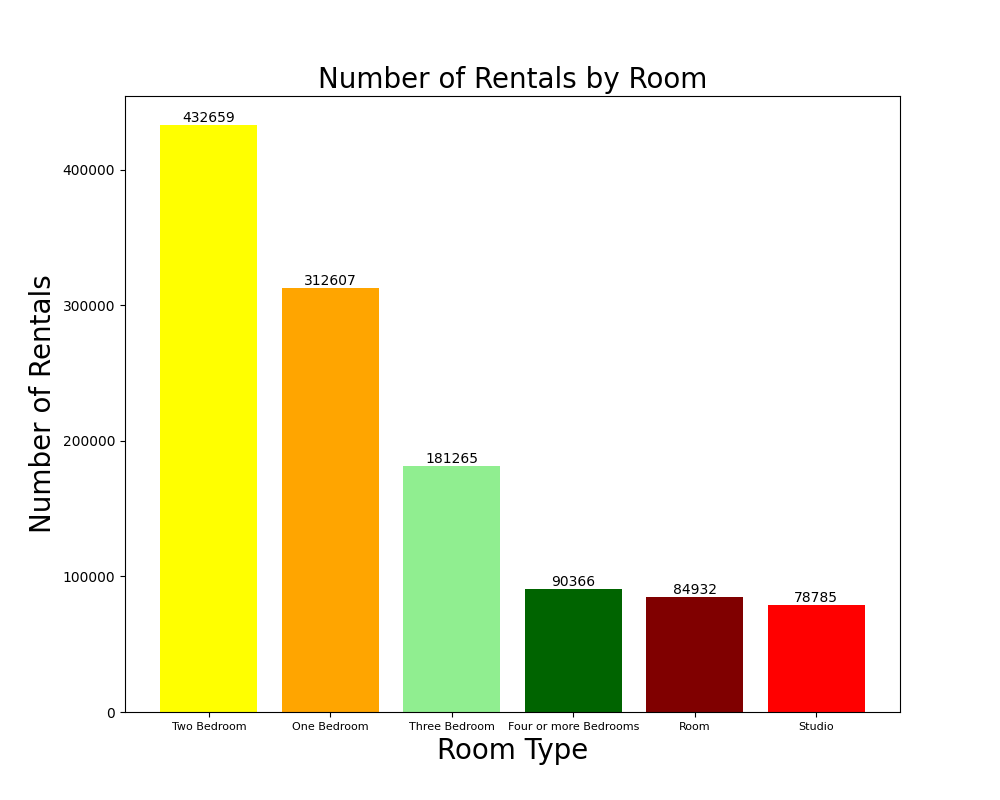
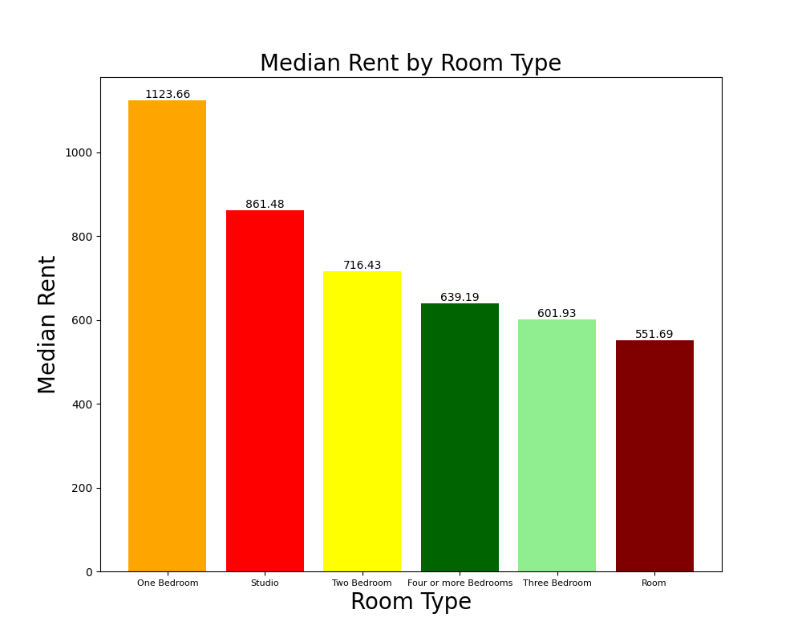

# General Analysis

From housing dataset of Q2 of 2011 to Q1 of 2019, we plot the number of rents and prices by house type to help understand the relative availability and prices of different house types.

## Number of Rents

## Prices

# Price Analysis by Borough

<iframe width="120%" height="1100" src="https://jaoshang.github.io/QM2groupproject/assets/boroughprices.html"></iframe>

### My story

To be honest, I'm having some trouble remembering right now, so why don't you just watch [my movie](https://en.wikipedia.org/wiki/The_Princess_Bride_%28film%29) and it will answer **all** your questions.
