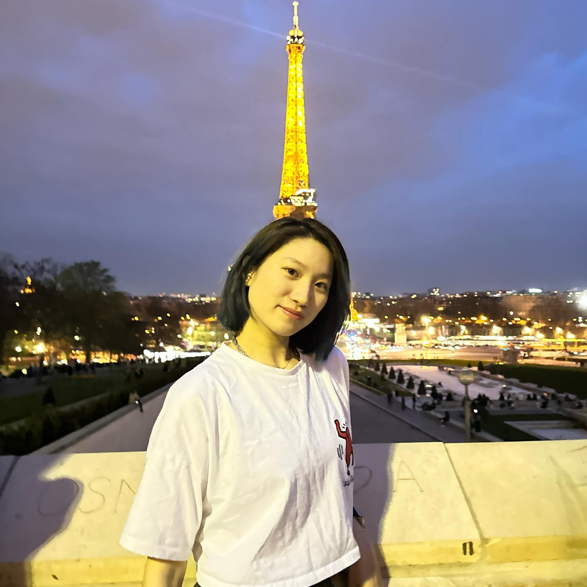

## Research questions

### Affordability
1. Where and what are the most affordable boroughs to rent in London?
2. What housing configurations are the most cost effective?

### Connectivty
3. How accessible are these boroughs to UCL, via public transport?

### Safety
4. How safe is it to live in these boroughs?

## Meet the team!

### Eurus Li

Hi I'm Eurus Li, a sophomore in Arts and Sciences, majoring in Science and Engineering and minoring in Societies. My research directions are archeology and economic management, and I'm interested in global real-time news and international situations. I also enjoy hanging out with friends and traveling during the holidays. I come from Beijing China, and I think London has given me something very similar to my hometown. I guess I will continue my study and life in the UK.

### Elena De Rossi

My name is Elena and I’m a second year Arts and Sciences student majoring in Societies and minoring in Engineering. My studies revolve around microeconomics and politics, with my strong interest being global issues and the management of international systems. I also love travelling and enjoy being outdoors and having an active lifestyle. I’m from Milan, Italy but have been in the UK for almost 4 years now, and plan to continue living here, although I do often enjoy going back and forth between the two countries.

### Joash Ang
(insert picture)
Hi! I'm Joash, a 2nd year in BASc on the Societies Pathway. I'm 22 this year and my hometown is Singapore. I enjoy travelling and outdoor activities, with rock climbing, hiking, scuba diving and hopefully soon-to-be skydiving being some of my hobbies/interests. Academically, my interests centre around International Relations, Sociology, and Psychology, and I'm taking Spanish as my language. Notably, I enjoy the field of security studies, especially using ethnography and studying security issues through the lens of human security. I am trying to brush up on my quantitative skillset on the side, especially Python using Mimo, which is sorta like Duolingo for coding.

### Yu Yang
img/IMG_6865.jpeg(img/PHOTO-2023-12-23-01-27-57.jpg)
Hi! My name is Yu, I’m a second year BASc student on the Sciences pathway. I’m from China and l’m 20 years old. l am interested in mathematics l believe that mathematics is a subject combines logic and aesthetics and in my leisure time I sometimes go fishing to relax myself.

### Yun Tan
(insert picture)
Hi I’m  Yun Tan, and I’m a second year student majoring in arts and sciences societies pathway. Within my pathway, my academic interests focus on economics,  management and marketing. I really enjoy the process of data visualization, which makes information more approachable. Besides, you can find me taking photographs, bouldering , and hiking. I always love to explore new interests so please call me if you plan to do something adventurous.

### Wilson Liu Zihong
(insert picture)
Hi! I am Wilson, a second-year sciences BAScer, and I come from China. My modules involve mathematics, coding and management sciences. Besides, my interest focuses on applying complexity system theory and interdisciplinary thinking in the studies of dynamic competition, fintech, and private equity investment. Moreover, I enjoy driving karting, and cooking in my free time.

