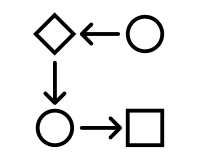

## Limitations of our datasets

{: width="100" height="100"}

<strong>1. Use of historical data</strong>

Due to difficulties accessing property websites' APIs, we have conducted our analysis using a historical dataset. Despite remaining valuable in recognising long-term trends and patterns, this dataset might only partially capture the current situation as the dynamic housing market is subject to rapid changes.

{: width="100" height="100"}

<strong>2. Endogeneity</strong>

The relationship between variables may be independent. Endogeneity is observed when there is a complex cause-and-effect relationship between different variables, making it unclear which influences what. In this context, changes in rental prices could affect the supply or demand for housing, leading to reverse causation.

## Limitations of our analysis

{: width="100" height="100"}

<strong>3. Housing configuration ambiguity</strong>

Our rent data set identifies various housing configurations, ranging from one bedroom to a studio to four or more bedrooms. This last arrangement encompasses more than one specific number of rooms (might include five, six, or seven-room configurations), making comparing rent per single tenant harder. To tackle this problem, we have decided to limit the '4 or more bedrooms' to four bedrooms only, meaning that our rent analysis overestimates prices for that housing configuration.

{: width="100" height="100"}

<strong>4. Restricted connectivity mapping</strong>

For the connectivity analysis, we have chosen to consider transport accessibility of different boroughs to UCL only to narrow our focus and avoid mapping potentially five more areas to connect to other London universities. However, this limits our analysis because we might need to recognise emerging trends by considering routes to other universities.
