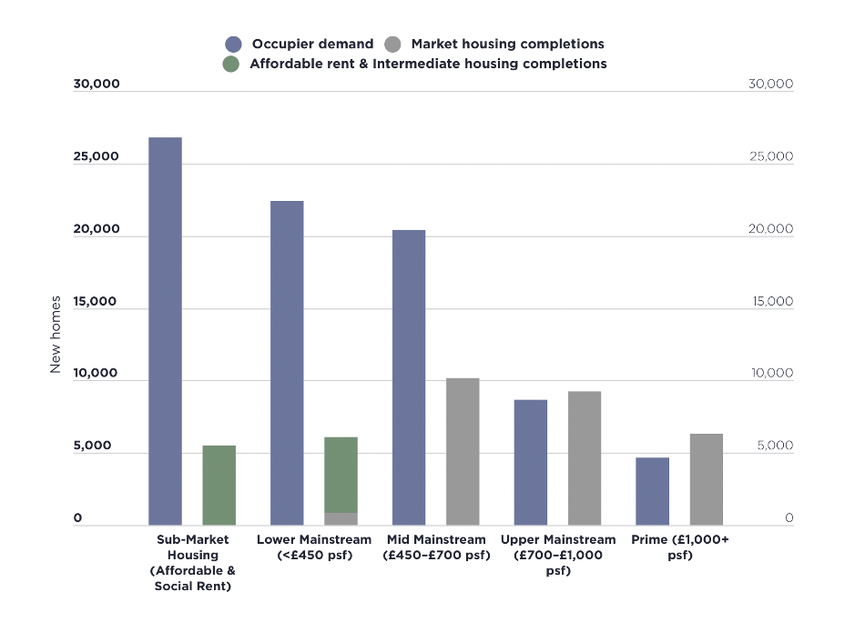
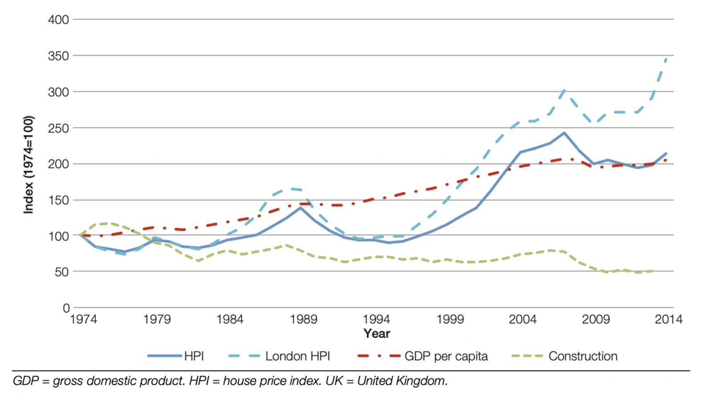
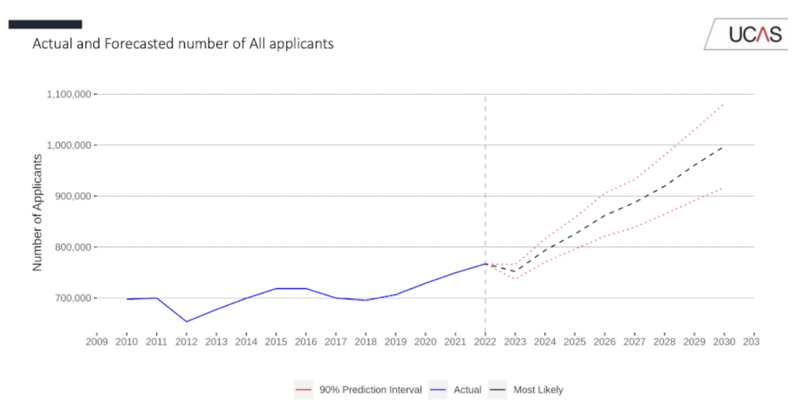
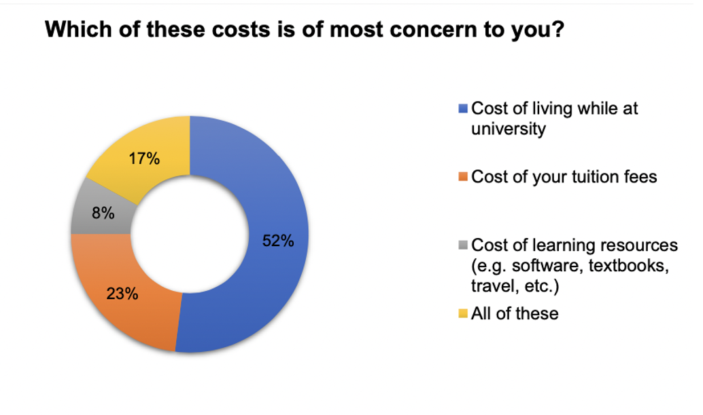
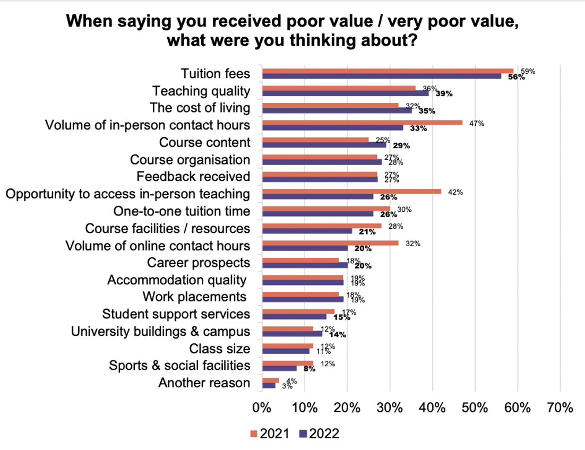

## The Housing Crisis
---
### Context
Recent literature on the UK housing market suggests that the country is facing a housing crisis, most severely in the London area. The UK housing dilemma can be linked to two key trends: a recurring supply and demand imbalance and the decline in housing affordability. British real estate company Savills uses the Standard Method to calculate housing need and provides key figures suggesting that the London market will continue to see high demand and low supply, especially at the lower end (figure 1) (Savills, 2023).

#### Figure 1: The lower end of the market will continue to see the highest demand with lowest supply

**Source: Savills Research, Moloir, DLUHC, CACI**

Low housing supply is coupled with great affordability issues, indicated by analyses on the current House Price Index. The following figure maps the trends in the HPI, GDP per capita, and construction rates between 1974 and 2015, showing HPI exceeding GDP per capita, most extremely in London. This paints a concerning picture of rising prices outstripping rising incomes, with supply being unresponsive to changes (Hilber & Schhni, 2016).

#### Figure 2: UK HPI (real), UK GDP per capita Index (real), and Construction Index trends

**Source: from (Hilber & Schhni, 2016) calculated from Nationwide, Office for National Statistics, Department for Communities and Local Government**

The trend remains when comparing the UK to other OECD members. The HBF’s 2023 international housing audit in fact found that the UK has the lowest percentage of vacant dwellings per capital of all OECD countries. Furthermore, considering house price to income, the rate of housing unaffordability in the UK has increased by a fifth more than in Europe, with rents in London being higher than most other European capital cities (Home Builders Federation, 2023).

### Theoretical standpoints
Given the trends outlined above, most literature agrees that the housing crisis is related to the UK’s fiscal centralization and a rigid planning system. In particular, inflexible planning and fiscal systems contribute to making the housing supply curve inelastic as they give insufficient incentives to residential development (Hilber & Schhni, 2016). Moreover, current policy efforts are deemed to be too demand-centred and therefore pushing up house prices rather than increasing supply.
The UK housing crisis has been characterised as one of under-supply, which has been mainly blamed on the failure to distribute sufficient land fast enough, causing a great difference between housing completions and number of households (Dianati et al., 2018). Tracing this back to the UK’s land use planning systems, scholars discuss the impact of binding construction constraints on house prices. A study by Hilber and Vermeulen found that severely planning constrained locations like London suffer from greater house prices (Hilber & Schhni, 2016). 
The literature also critically evaluates the UK’s policy-making efforts, particularly stressing the reform of the planning system. Dianati et al. argue that existing policies tend to only address the symptoms of the housing crisis rather than its underlying causes therefore failing to address affordability issues. In London, policies such as ‘Help-to-Buy’ are criticized for feeding demand rather than boosting supply. On the other hand, the supply preoccupation is limiting the development of policies aimed at mediating demand and introducing stabilising forces (Gallent et al., 2017). Overall, as the stagnant supply is coupled with positive demand shocks, prices will continue to rise causing the affordability crisis to persevere.

---
## The student market
---
### Context
The literature indicates a growing number of students in the UK and a favourable trend in student mobility, both on a global scale and within the country. UCAS’s Journey to a Million in fact predicts that UK higher education will reach a million applicants by 2030, marking a significant growth in demand.

#### Figure 3: projected total number of applicants until 2030

**Source: UCAS 2022**

From an international point of view, data from the UNESCO shows how the mobility of global students has greatly increased over the past few decades, with numbers growing from 2 to 6.36 million between 2000 and 2020 (Uis, 2020). This trend can be further projected into the future, as recent UCAS data on the 2023 cycle shows a 3.1% increase in international demand (UCAS, 2023), highlighting the ongoing attraction of the UK higher education system.
However, the literature also stresses the importance of considering increasing student demand in shifting the status of the UK economy and its needs, particularly whether it is equipped to face the predicted higher education growth. An increasing student population in London places stress on the city’s already saturated housing market. Growth trends coupled with concerns on affordability and housing supply create a complex landscape and are being analysed through government forums and policymaking.

### Theoretical standpoints
Given the context above, particularly the importance of international students to the UK higher education market, London can be analysed through the push and pull model. Applicable to a wide range of contexts, this model has been increasingly used by scholars to identify the factors that impact students’ decision to enter a different higher education market. More precisely, Mazzarol and Soutar identify push factors as the negative conditions that drive individuals outside their home country with the aim of finding greater stability and better opportunities and pull factors as the positive conditions in the host country that encourage the same individuals to move to that new location (Mazzarol & Soutar, 2002).
Social and economic factors play an important role in the push-pull model, making it greatly relevant to our research. One one hand, the opportunity for academic growth present in London attracts ambitious individuals, leading to a sustained student intake. According to QS rankings, London is in fact consistently ranked as the best student city (Quacquarelli Symond, 2023). The city has been defined not only as an academic hotspot, having the most universities of any UK city, with 3 of them making it into the global top 50, but it is also seen as a European and international hub for most industries and remains highly ranked for employer activity. On the other hand, however, having access to stable employment and affordable living arrangements makes it easier for students to remain in the host country, foreshadowing potential disruptions in future student mobility given the current affordability crisis. One of many, the CEO of the Russel Group has expressed his concerns on the fact that rent now takes up most of the average student loan.

> "Without action this will only worsen in the next academic year as maintenance loans for students in England increase by only 2.8%, far below current inflation levels"

**Bradshaw (CEO of the Russel Group), 2023**

This is visually shown by the student academic experience survey by the HEPI and UCAS that highlights the cost of living as an increasingly important concern in a student’s life 

#### Figure 4: Studying related costs that are currently of most concern to students

**Source: 2022 Student Academic Experience survey**

,and as one of the key drivers of unsatisfaction (Figure 5) (Neves & Brown, 2022).

#### Figure 5: Factors influencing perceptions of poor value for money

**Source: 2022 Student Academic Experience survey**

Given that London universities are significant contributors to the economy and labour market, literature by government bodies highlights an agenda stressing for the improvement of student accommodation to avoid compromising London’s growth and attractiveness (GOVUK, 2023). The city in fact risks losing talent and investment if unaffordability and undersupply are not addressed.

---
