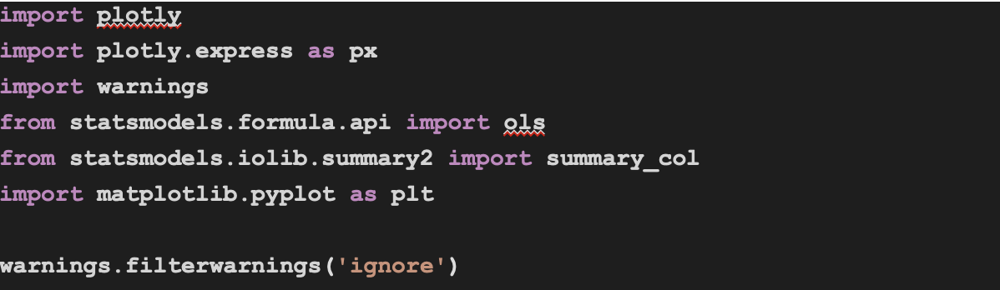
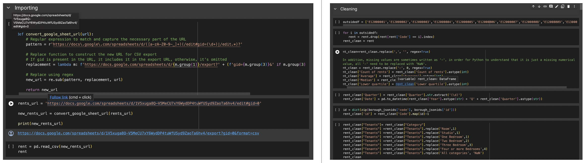
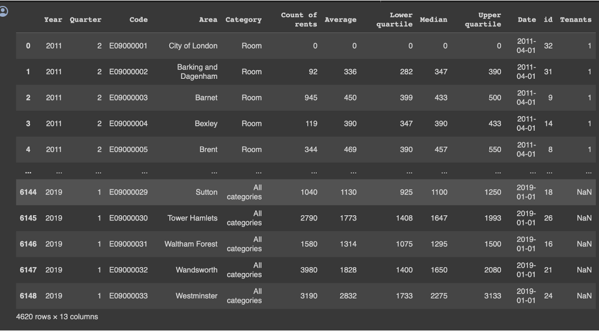
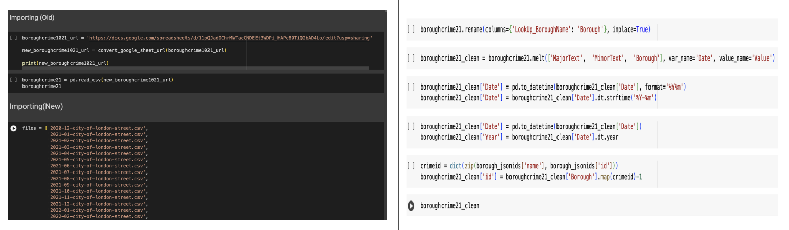
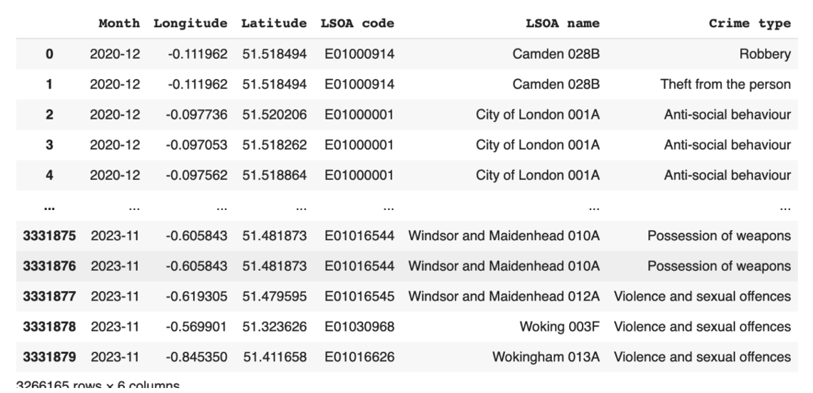
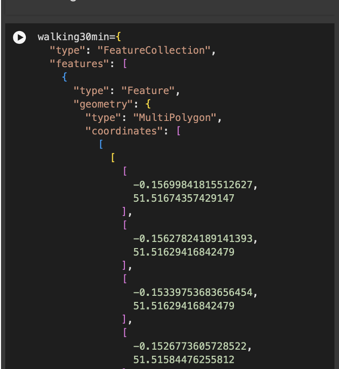
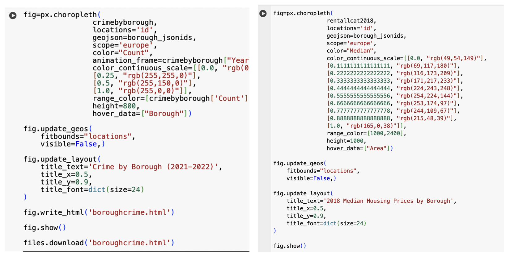
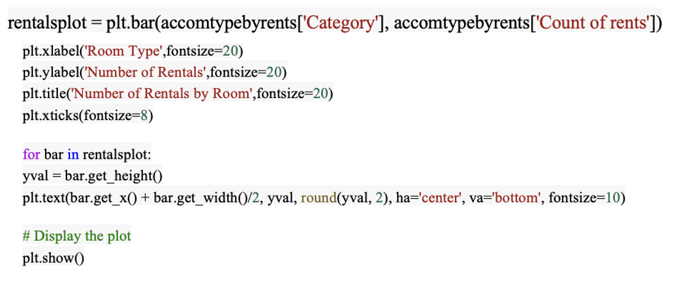

After reviewing literature on the student housing market in London and noting the significant imbalance between demand and supply, we concluded that the primary aim of this research is to uncover patterns that can streamline the student accommodation search process, providing valuable insights for informed decision-making. However, we realised that analysing student housing within the London borough area would be challenging, mainly due to the constraints in effectively gathering quality data about where students actually live, which relates to ethical issues. We decided to restrict our study to UCL students and the overall housing market, since there is no difference in price and distribution of housing between student renting and normal renting.

## Importing libraries
For any visualisation being made, the first step was always to import the libraries we would use. In this case, these were:

1. <strong>Numpy</strong>
2. <strong>Pandas</strong>
3. <strong>Matplotlib</strong>
4. <strong>Seaborn</strong>

These libraries are for better support with matrices and arrays, data manipulation, making plots and greater customisation of these plots.

{: width="400" }

## Data cleaning
Cleaning and correcting raw data improves its quality, accuracy, and reliability for analysis or other purposes. The goal of data cleaning is to ensure that data is free from errors, duplicates, inconsistencies, and other issues that might affect its usability. In our project, the rent data and crime data will be cleaned by applying python, they will be presented in two different data frames.

We import our rent data and crime data respectively and clean them as follows:

### Rent

{: width="800" }
{: width="500" }

The rent data after cleaning will be presented in the dataframe with columns including information on time period, category, and summary statistics of the rents. We defined our study period as 2012-2018 based on the data available, measuring by year. The dataset includes prices in respect to different types of accommodation, i.e., studio,one bedroom apartment within borough area.

### Crime

{: width="800" }
{: width="500" }

The crime data after cleaning by python is presented in a dataframe with columns including the information of time of crime, crime locations, and crime types. After cleaning, we remain with data of borough-specific crime rates, making our analysis more feasible.

### Travel time isochrone

{: width="400" }

An isochrone is a geographic area that represents locations reachable within a certain time frame from a specific point, based on a mode of transportation. In our case, the data represents areas that can be reached within 30 minutes of walking, cycling and using public transportation from a specific point, using coordinates (longitude and latitude) that outline the areas.

## Data visualisation

### Choropleth map
Onced the datasets are cleaned, the first visualisations to make are choropleth maps which display varying house prices and crime rates across time and in the various boroughs.

Below are the sample codes (rent on the right, and crime on the left) used to plot this information.

{: width="800" }

We first used the respective data frames to contain necessary data for the map, and define the geographical boundaries of each borough using a GeoJSON object. After that, we used the px.chotopleth function from plotly express to create the choropleth map, and use location parameters to link the DataFrame's borough identifiers with their geographical representations in GeoJSON object. We then specify the map's geographical scope to 'Europe' to focus on the relevant area. The next step is to assign the relevant columns from the DataFrame to the 'color' parameter, and setting the color scale range from 500 to 2750, reflecting the expected range of house prices and crime rates. Lastly, we implemented an animated transition through the years using 'animation_frame' parameter that is set to 'year' column.

### Histogram
A histogram displays information in a simple manner whilst being effective at emphasising differences. For the sake of this example, we will be making a histogram of the number of rentals by rooms in our rent dataset. This will give an indication of what categories have a greater popularity. Here we are creating a bar chart using 'plt.bar() function and using matplotlib to set the variables we want to plot as x and y

{: width="800" }

